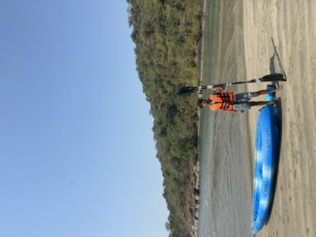
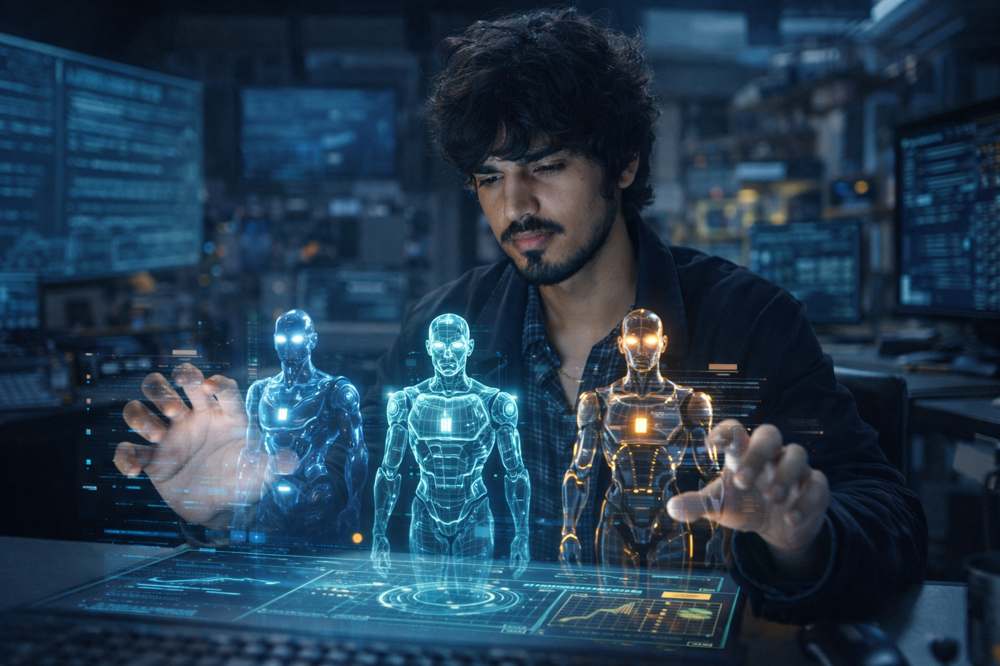

<!--  -->

<h2 style="border: none">#EngineeringLife : )</h2>

Hello there, I'm a curious engineer curating wonders.

Technology fascinates me—the impact it brings to people's lives is astonishing. Here I am trying to add value in the process. You can find me building AI agents and projects in my [Repo](https://github.com/mramanindia).

**Beyond Engineering:** I enjoy delving into philosophy, watching documentaries/case studies, and adventuring in the wild. These interests help me stay curious, inspired, and fit.

Feel free to poke around, use anything you find useful, or say hi.

<h2 style="border: none">Languages & Tools</h2>

**Agentic AI & LLMs**

**Languages & Infrastructure**

<h2 style="border: none">Projects</h2>
Have been Building AI agents that Monitor and fixes Another AI agents at Noveum.ai. Also in process of builidng sunnom.in - Daily journal and companionship platform.

  

<h2 style="border: none">Connect</h2>

[LinkedIn](https://www.linkedin.com/in/mramanindia/) · [GitHub](https://github.com/mramanindia) · [Portfolio](https://mramanindia.github.io/)
